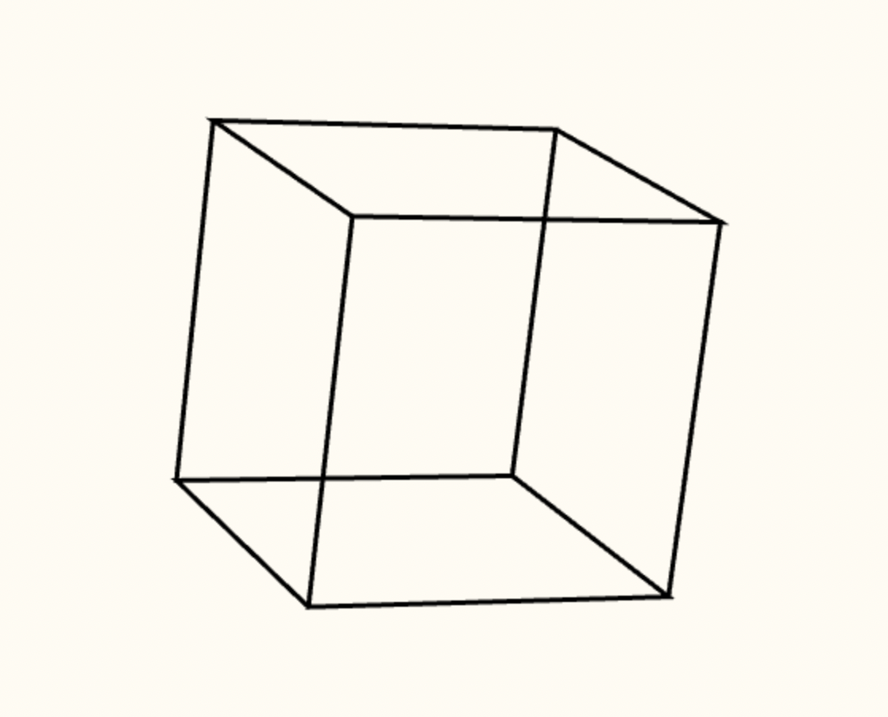

# 3D to 2D Example

[**Watch the YouTube video for this project**](https://www.youtube.com/watch?v=eoXn6nwV694)



# Running

### 1. Clone this project

### 2. Install [yarn](https://yarnpkg.com/)

### 3. Install dependencies

```
yarn install
```

### 4. Run code

```
yarn parcel index.html
```

### 5. Go to [http://localhost:1234](http://localhost:1234)

# License

This project is licensed under the MIT License - see the [LICENSE](./LICENSE) file for details
